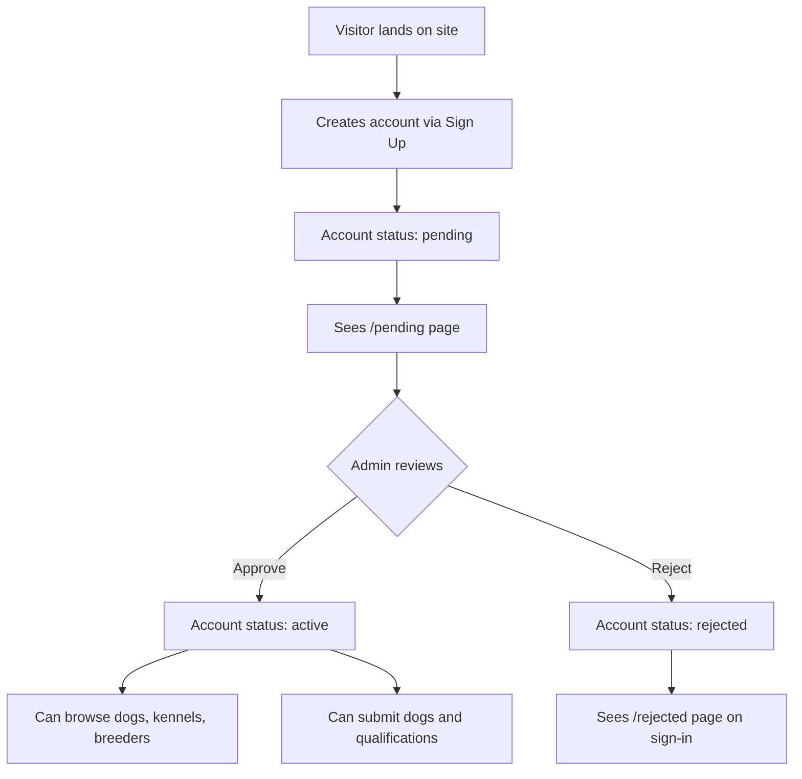
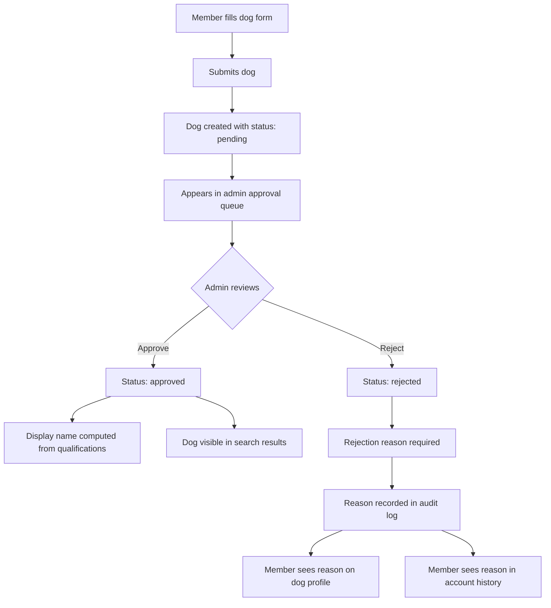
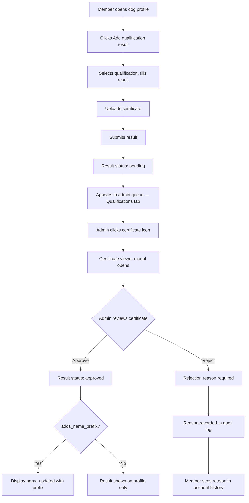
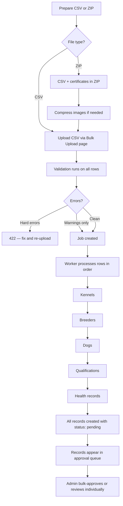
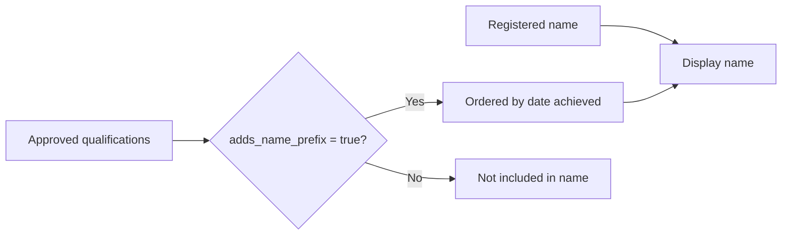

# How data flows through the registry

This page shows how records move through the system from submission to
approval. Each diagram is followed by a plain-English explanation.

---

## 1. Member onboarding



Every new account starts as pending. The member sees a waiting page until an
administrator approves their account. Rejected members see a rejection page
when they sign in. Only active members can access the registry.

---

## 2. Dog submission



Dogs are not visible in search results until approved. On approval, the display
name is computed from any approved qualifications that add a name prefix. On
rejection, the admin must provide a reason, which the submitter can see on the
dog's profile page and in their account history.

---

## 3. Qualification result



Certificate upload is optional at submission but required before approval
(admins can override at their discretion). The certificate viewer modal lets
admins view the certificate and approve or reject directly from the modal.
When a qualification with `adds_name_prefix = true` is approved, the dog's
display name updates immediately.

---

## 4. Bulk upload



A single upload can contain mixed record types. The worker processes them in
dependency order so that a kennel is created before the dogs that belong to it.
All records go to the pending queue — bulk upload never bypasses approval. ZIP
files can include certificate images matched to qualification rows by filename.

---

## 5. Display name computation



**Example:**

```
Registered name: Kennel Argo
Approved qualifications:
  - HZP (achieved 2021-06-15) — adds_name_prefix = true
  - VGP (achieved 2022-03-20) — adds_name_prefix = true

Display name: HZP-VGP Kennel Argo
```

The display name is computed by the backend, never stored in the database.
Qualification abbreviations are joined with hyphens and ordered by date
achieved (earliest first). The display name appears everywhere: search
results, dog cards, profile headings, and pedigree links.

---

## 6. Data visibility rules

```mermaid
flowchart TD
    subgraph Public
        A[Landing page only]
    end

    subgraph Pending member
        B[/pending page only]
    end

    subgraph Active member
        C[Dog search and profiles]
        D[Kennel profiles]
        E[Breeder profiles]
        F[COI calculator — if permitted]
        G[Own account history]
        H[Submit dogs and qualifications]
    end

    subgraph Kennel owner
        I[Everything above]
        J[Kennel management]
        K[Kennel audit history]
        L[Bulk upload — if permitted]
    end

    subgraph Admin
        M[Everything above]
        N[Approval queue with all tabs]
        O[Full audit log — History tab]
        P[Bulk upload and bulk approve]
        Q[Role and user management]
        R[Certificate viewer]
    end
```

The registry is members-only. Unauthenticated visitors see only the landing
page. Pending members see a waiting page. Active members can browse and submit.
Kennel owners additionally manage their kennel's dogs and see kennel-specific
audit history. Admins have full access to the approval queue, audit log, bulk
operations, and role management. Certificates are visible only to admins in the
approval queue.
